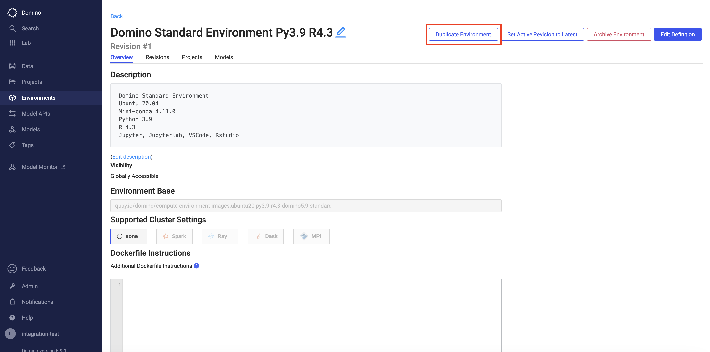
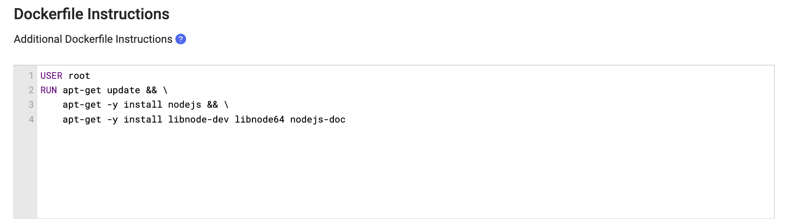
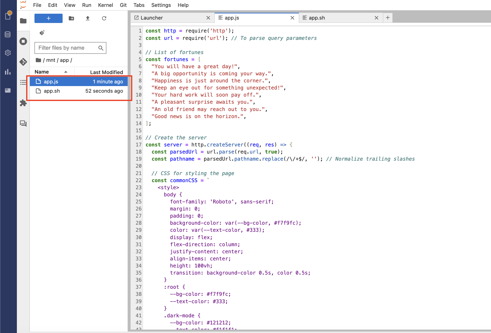
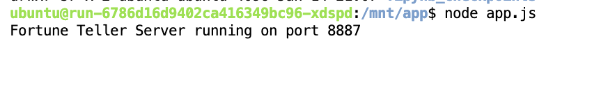
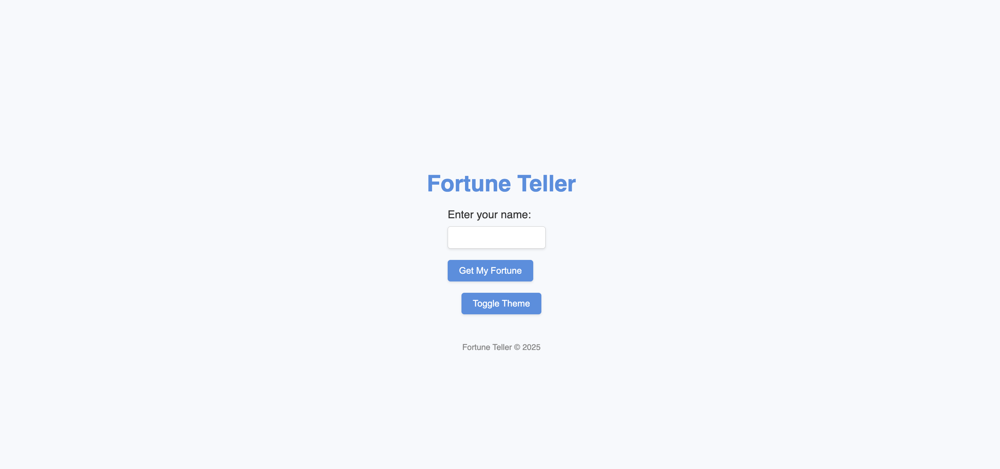
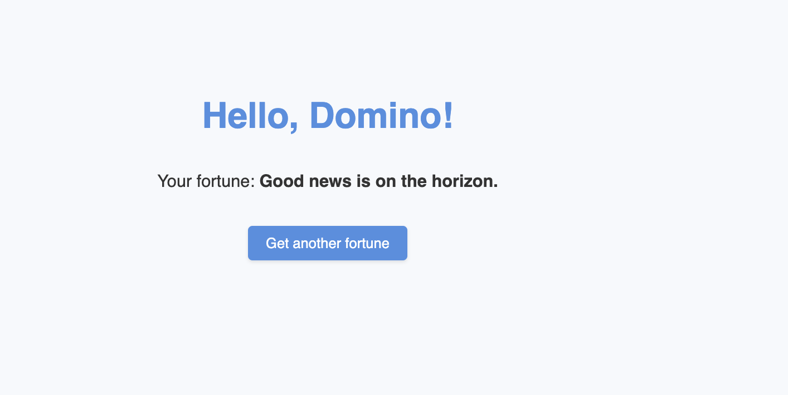
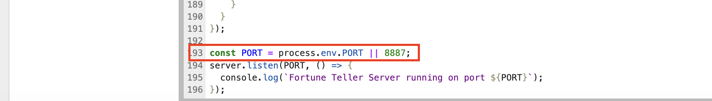
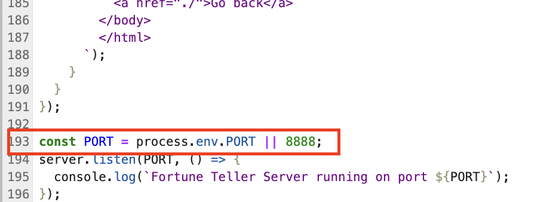
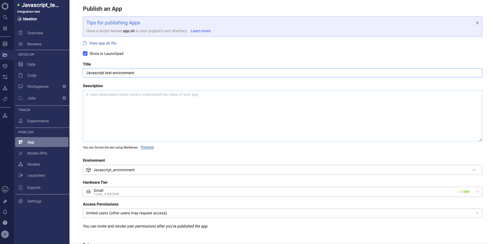
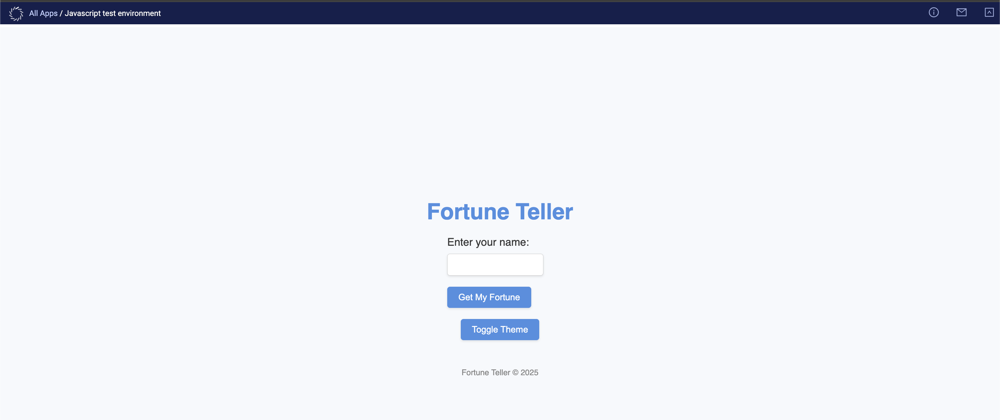

# Developing a Web App in Javascript in Domino

Data scientists can publish interactive apps to share their findings with stakeholders. Apps are endlessly flexible and can do things like share results with stakeholders, host interactive analytical dashboards, provide an interface to deployed models, and much more.

We will be creating a simple Node.js web server that generates random fortunes for users based on their input. Users can enter their name, receive a personalized fortune, and toggle between light and dark themes for the webpage.

## Features

### Homepage:
- A form where users can enter their name and submit it to receive a fortune.
- A button to toggle between light and dark themes, with theme preferences saved in the browser's local storage.

### Fortune Page:
- Displays a personalized greeting using the user's name.
- Shows a randomly selected fortune from a predefined list.
- Includes a link to return to the homepage and generate another fortune.

### Error Handling:
- If the name is not provided in the query parameters, an error message is displayed with a link to return to the homepage.

### Responsive and Styled:
- Includes simple and responsive CSS styling for both light and dark themes.
- Provides a smooth transition between themes.

## Prerequisites:

- Duplicate the environment that would be used in running the Javascript application.
 

- Update the Dockerfile instructions in the environment definition to install the necessary software and dependencies to execute the file type and script in a workspace.

    ````
    USER root
    RUN apt-get update && \
    apt-get -y install nodejs && \
    apt-get -y install libnode-dev libnode64 nodejs-doc
    ````
  

- Further instructions on how to build a new environment can be found [here](https://docs.dominodatalab.com/en/5.11/user_guide/5dd2c1/edit-environment-definition/).

## Steps to Test the App in a Workspace

-  Launch a workspace using the environment updated above and copy the `app.js` and `app.sh` files to the workspace as seen below.

   
  - Open a new terminal and execute the `app.js` script i.e. the content of the `app.sh` file. You should see a similar screenshot below that indicates that Javascript app is running on port 8887.
    `node app.js`
    

  - To verify this from your workspace, run the below command to extract the specific URL to access the web app.

    ``````
    echo -e "import os\nprint('https://<DOMAIN>/{}/{}/notebookSession/{}/proxy/<PROXY-PORT-NUMBER>/'.format(os.environ['DOMINO_PROJECT_OWNER'], os.environ['DOMINO_PROJECT_NAME'], os.environ['DOMINO_RUN_ID']))" | python3
    ``````
    Replace the following values:
    - **DOMAIN**: This is the URL for your domino deployment.
    - **PROXY-PORT-NUMBER**: This is the port specified in your code that the webserver will listen on. In the current example, the web server has been specified to listen on port 8887.
    
  - Extract the URL from the above command, open a new browser and paste the URL to access your Web App. You should see a screenshot similar to the below.
    

  - Enter your name and click on `Get My Fortune` to reveal the fortune
    

# Steps to run the Javascript through Domino Web App

After you have tested and confirmed that the Javascript app is working as expected, you can go ahead and run the App in your project. 

Please note that Domino Web App runs on port 8888 by default, hence prior to running to Web App, edit the `app.js` script and change line 193 from `8887` to `8888`.

Before changing the port number, it should look like below:



After changing the port number, it should look like below:



- Once the above is completed, navigate to the App section of your project and click on publish.



- Once the web app is running, click on View App and you should be able to see the same Javascript App as seen below.

