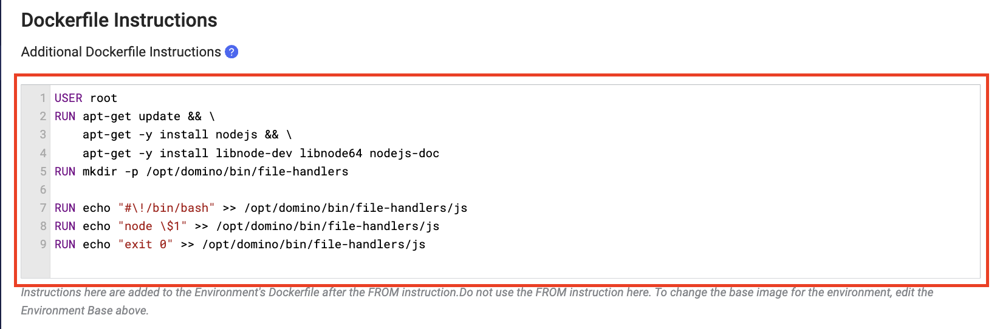

***Developing a Web App in Javascript in Domino***

*Prerequisites:*

- Duplicate the environment that would be used in running the Java application.
 

- Update the Dockerfile instructions in the environment definition to install the necessary software and dependencies to execute the file type and script in a workspace.

    ````
    USER root
    RUN apt-get update && \
    apt-get -y install nodejs && \
    apt-get -y install libnode-dev libnode64 nodejs-doc
    RUN mkdir -p /opt/domino/bin/file-handlers
    
    RUN echo "#\!/bin/bash" >> /opt/domino/bin/file-handlers/js
    RUN echo "node \$1" >> /opt/domino/bin/file-handlers/js
    RUN echo "exit 0" >> /opt/domino/bin/file-handlers/js
    ````
  

- Further instructions on how to build a new environment can be found [here](https://docs.dominodatalab.com/en/5.11/user_guide/5dd2c1/edit-environment-definition/).

*Steps to Test the App in a Workspace*

-  Launch a workspace using the environment updated above.
